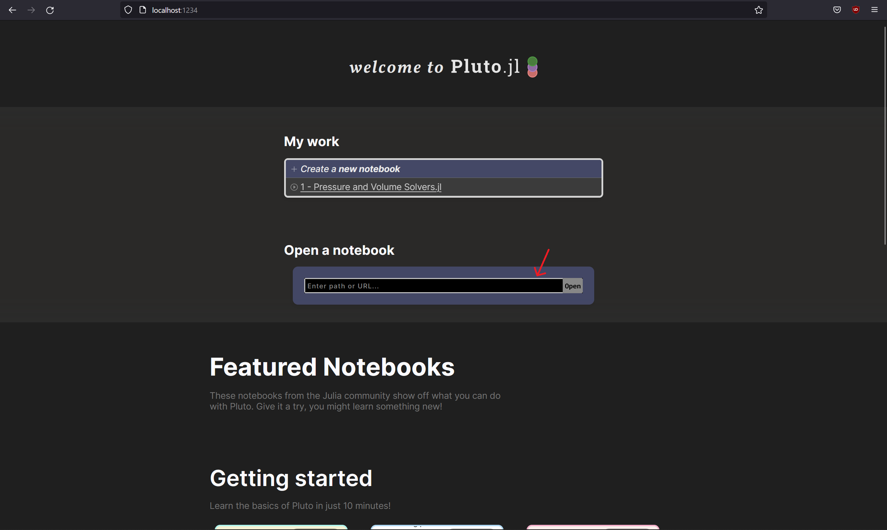

# introduction-to-computational-thermodynamics
A short course designed to introduce key concepts in computational thermodynamics to chemical engineers 

## Installation

To get going with this you'll need two things:
1. A working Julia installation
2. Installation of Pluto.jl

There is a full video walkthrough of this made by the creator of Pluto here:

https://www.youtube.com/watch?v=OOjKEgbt8AI

### Installing Julia

To download and install Julia, please go to
https://julialang.org/downloads/

and download the binary for your operating system. For a step-by-step guide, make sure to check out the "help" section of the download page.


### Installing Pluto

Installing Pluto is very easy. Find and start Julia on your machine, open up the app (this opens the REPL), press ```]```, this should open the package manager. Then, write ```add Pluto``` to install the package.

Once Pluto has finished being installed, press backspace to return to the command-line, then run ```using Pluto``` to load in the package. When it has finished loading, you can type ```Pluto.run()``` to begin your session!

This is also documented in the README of the Pluto.jl github:

https://github.com/fonsp/Pluto.jl

Once you have installed Pluto, you do not have to add it again. In each new session of Julia, you can just run ```using Pluto```, followed by ```Pluto.run()```.

### Running notebooks

To run each notebook, begin a Pluto session, go to the github page for the course (where you likely are if you're reading this!), find the relevant notebook, and copy the link at the top of the page


then paste this into the Pluto ```Open from file:``` textbox in the Pluto homescreen and click ```Open```.



Each notebook may take quite a while to run when you first open it, so allow for ~10 minutes for all packages to install and get set up.

### Still have issues?

We will be running a debugging session on Tuesday 30th should you still have any issues or questions with Julia, Clapeyron, or Pluto.

## Preliminary work

To get used to Julia and the Pluto environment specifically, the developers created 6 introductory notebooks. Before the course, please take a look at these - they will help a lot with introducing you to the environment. To access these, scroll down on the Pluto homepage. We would like you to take a look at "Getting started" and "Basic mathematics", but if you're interested then please keep looking through!

